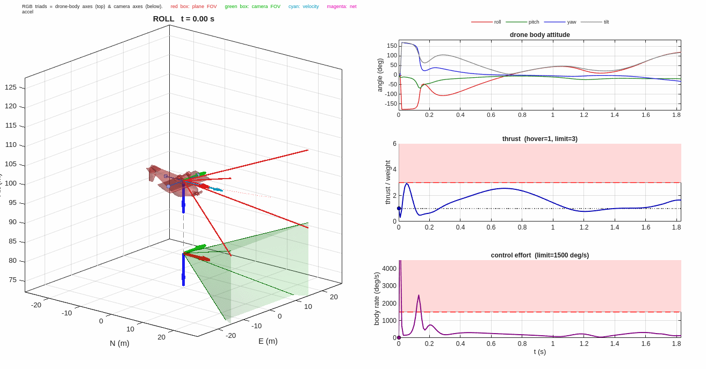
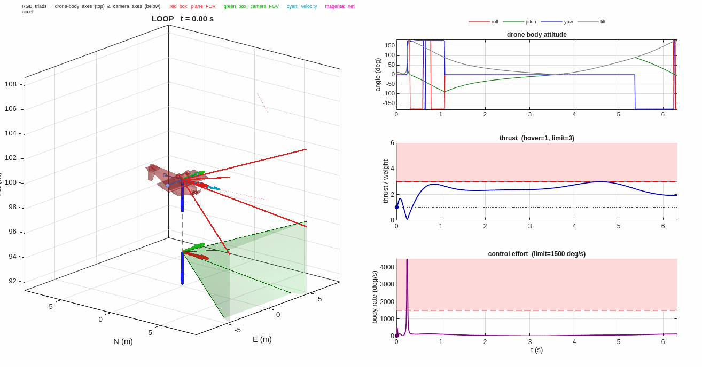
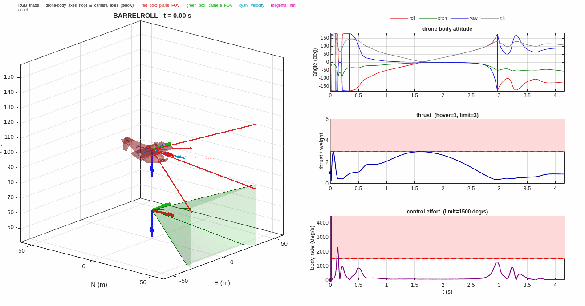
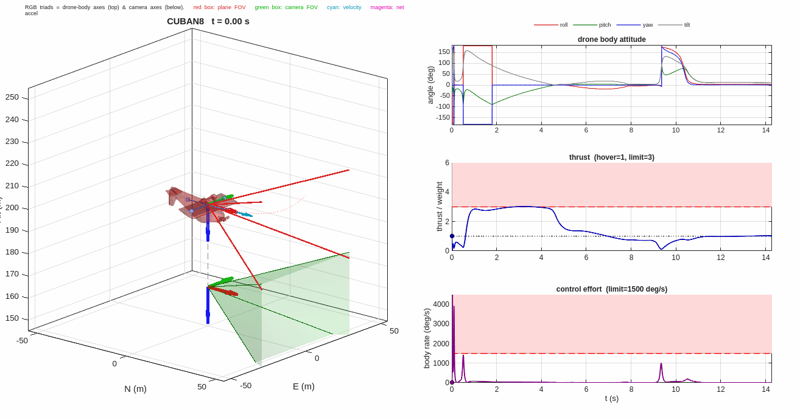

# Ghost Tracking — Fixed-Wing Flight Emulation on a Multicopter

Make a multicopter with a **3-axis camera gimbal** reproduce the **camera pose
(position + orientation)** of a **fixed-wing aircraft** flying aerobatic
maneuvers. The multicopter tumbles its airframe to vector thrust along the
aircraft's flight path, while the gimbal keeps the camera view locked onto the
fixed-wing's viewpoint — a *physical-to-physical* emulation: the rendered camera
stream is intended to be indistinguishable from the fixed-wing's.

The controller is an **exact dynamic feedback linearization (DFL)** of the
multicopter–gimbal system, made practical with three theory-grounded additions
(no ad-hoc clamps):

1. **One-parameter critically-damped gains** — all error-dynamics poles placed at
   a single bandwidth `ω` (binomial gains), so there is no hand-tuned gain vector.
2. **Singularity-robust inverse** — the `1/q0` body-attitude representation
   singularity (encountered when the airframe inverts past 90°) is damped, so the
   exact inverse stays bounded through inverted flight while preserving tracking.
3. **Reference governor** — a pace factor `λ ∈ (0,1]` confines the reference to
   the **feasible set `F`** (the trajectories whose inverse inputs respect the
   actuator and gimbal limits), so the controller emulates the fastest version a
   given platform can actually fly.

## Demo

The airframe (RGB body axes) tumbles — even inverting — while the camera frame
(offset below) and its field of view stay aligned with the fixed-wing's:

| Roll | Loop |
|---|---|
|  |  |

| Barrel roll | Cuban-8 |
|---|---|
|  |  |

Each panel shows the 3D scene (red = fixed-wing, **red box** = its camera FOV,
**green box** = the multicopter camera FOV), the drone body attitude, the
thrust-to-weight (with the feasibility limit), and the control effort.

## Results

A ~5 kg multicopter emulating a Red Bull Edge-540 reference, with each maneuver
paced by the governor to a feasible thrust-to-weight (≤ 3):

| Maneuver | pace `λ` | peak T/W | pos. error (MAE) | camera-orient. error (max) | feasibility |
|---|---|---|---|---|---|
| Loop | 0.87 | 3.0 | 0.14 m | 0.003° | clean (gimbal healthy) |
| Roll | 0.60 | 3.0 | 0.07 m | 0.006° | clean (gimbal healthy) |
| Soft roll | 0.60 | 3.0 | 0.11 m | 0.02° | gimbal near limit |
| Barrel roll | 0.60 | 3.0 | 0.10 m | 0.03° | gimbal near limit |
| Split-S | 0.29 | 3.0 | 0.06 m | 0.003° | gimbal near limit |
| Cuban-8 | 0.35 | 3.0 | 0.07 m | 0.008° | gimbal near limit |

Camera-orientation tracking is essentially exact (sub-0.05°) on every maneuver;
position tracking is sub-metre. Feasibility is bounded jointly by **thrust
authority** and the **gimbal kinematic range** — see `ECC_2026/CONTROL_FEASIBILITY.md`.

## Requirements

- MATLAB (R2021b+). No toolboxes required for the core simulation/plots.

## How to run

From the repository root in MATLAB:

```matlab
addpath('DFL_controller','models','utilities','trajectory_configs','fw_maneuvers');

% Simulate one maneuver: run_compare3(config, tag, omega, lambda)
%   omega  = stabilization bandwidth (default 30)
%   lambda = reference-governor pace in (0,1] (default 1 = full speed)
out = run_compare3('loop', 'v3_loop', 30, 0.87);   % governed (feasible) loop
disp(out.metrics)                                   % MAE/peak errors, gimbal margin

% Render an animated GIF (3D scene + attitude + thrust + control effort):
addpath('utilities');
animate_maneuver('loop', 'mode', 'follow', 'TWmax', 3);   % -> plots/gifs/loop.gif
```

Available maneuver configs: `loop`, `roll`, `rollsoft`, `barrelroll`, `splits`,
`cuban8` (in `trajectory_configs/` and `fw_maneuvers/`).

## Repository structure

```
DFL_controller/
  dfl_controller3.m            3-axis DFL control law (singularity-robust)
  critically_damped_gains.m    one-parameter (omega) binomial gain rule
  alpha_gimbal_func3.m         auto-generated drift term  (alpha)
  beta_gimbal_func3.m          auto-generated decoupling matrix (beta)
  controller_generation_v2.m   symbolic derivation of alpha/beta
models/
  unified_dynamics3.m          FW reference + governor pacing -> quad controller
  quadrotor_dynamics_realtime3.m  18-state quad + 3-axis gimbal plant
  fw_6dof_quat.m               6-DOF fixed-wing model (pos/vel/accel/jerk/snap)
  quad_platform_params.m       ~5 kg platform parameters (single source of truth)
trajectory_configs/, fw_maneuvers/   per-maneuver fixed-wing references
utilities/
  animate_maneuver.m           GIF renderer (body axes, camera FOV, panels)
  plotting3.m                  static result plots
run_compare3.m                 main runner (controller + gains + governor)
ECC_2026/                      paper sources (root.tex), plan, feasibility analysis
plots/gifs/                    rendered maneuver animations
```

## Paper

The accompanying manuscript is in `ECC_2026/` (`root.tex`). See
`ECC_2026/JOURNAL_PLAN.md` for the contribution outline and
`ECC_2026/CONTROL_FEASIBILITY.md` for the feasible-set analysis.
